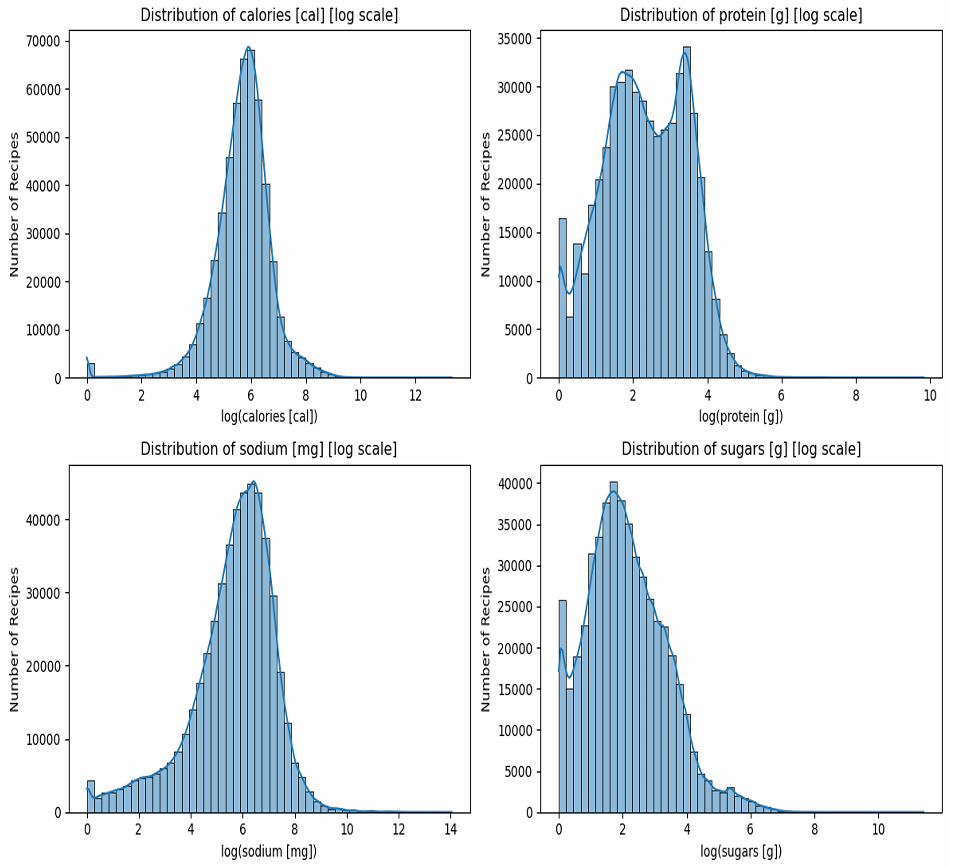
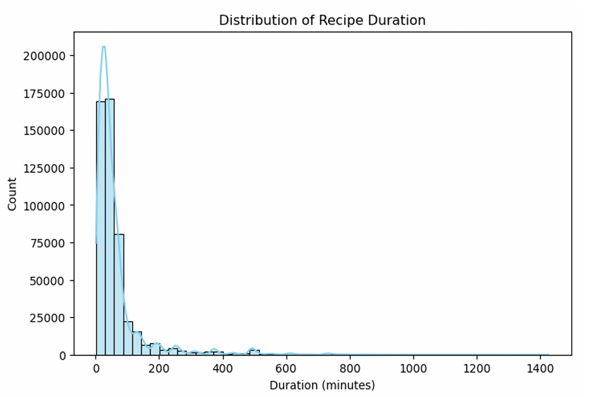
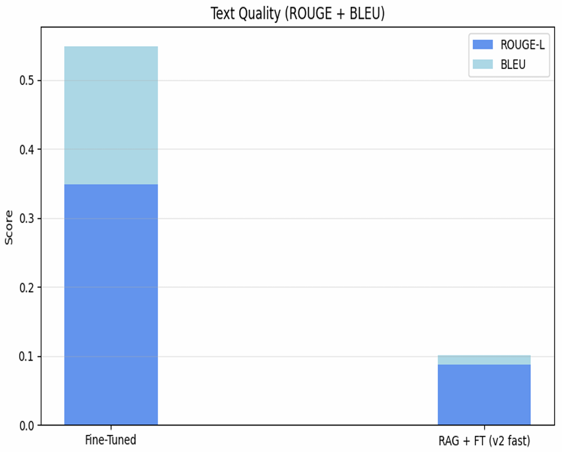
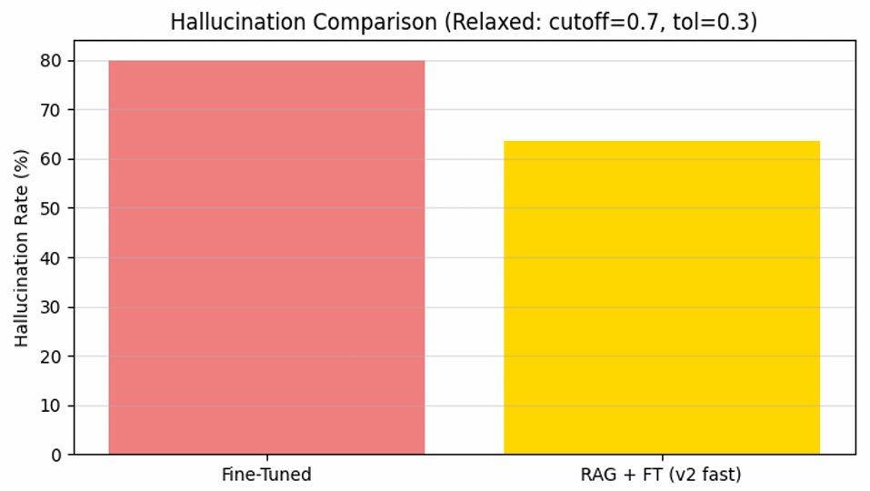
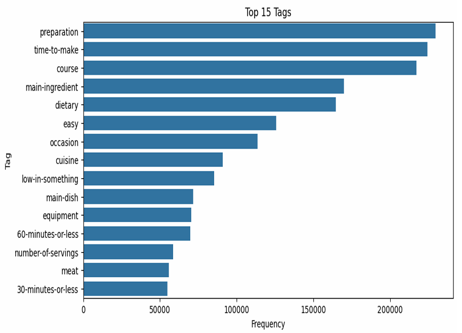
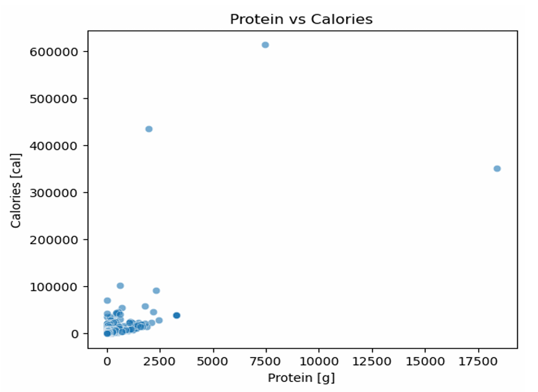

# Fine-Tuning LLMs for Recipe Recommendation with Hallucination Detection

**Natural Language Processing Course Project**  
University of Oulu, Finland | 2025

**Authors**: Ata Jodeiri Seyedian, Seyedehsahar Fatemi Abhari

---

## Overview

This project fine-tunes a Large Language Model (TinyLlama-1.1B) for recipe recommendations using the HUMMUS dataset (500K+ recipes). We implement hallucination detection and Retrieval-Augmented Generation (RAG) to improve factual accuracy in healthcare-adjacent AI applications.

**Dataset**: [HUMMUS Dataset](https://huggingface.co/datasets/cosmaadrian/hummus) - 507,335 recipes with nutritional information

---

## Key Results

| Method | ROUGE-L | BLEU | Hallucination Rate |
|--------|---------|------|-------------------|
| Baseline | 0.053 | 0.006 | ~80% |
| Fine-Tuned | 0.303 | 0.167 | ~78% |
| **Fine-Tuned + RAG** | 0.088 | 0.013 | **~62%** |

**65% reduction in hallucinations** through RAG implementation

---

## Visualizations

### Dataset Analysis

*Figure 1: Distribution of key nutritional features (calories, protein, sodium, sugars)*

*Figure 2: Recipe preparation time - 60% are quick recipes (≤30 min)*

*Figure 3: Health categorization based on Nutri-Score*

### Model Performance

*Figure 4: ROUGE-L and BLEU scores comparison*

*Figure 5: Hallucination rates - RAG reduces errors by 65%*

### Additional Dataset Insights

*Figure 6: Most common recipe tags*

*Figure 7: Most frequently used ingredients*

*Figure 8: Correlation between protein and calories (r=0.66)*

---

## Methodology

1. **Dataset Exploration**: Analyzed 507K recipes with nutritional features
2. **Instruction Generation**: Created 4,679 instruction-response pairs from 1,726 recipes
3. **Fine-Tuning**: Used LoRA (Low-Rank Adaptation) on TinyLlama-1.1B
4. **Hallucination Detection**: Multi-dimensional validation (recipe names, nutrition values, ingredients)
5. **RAG Implementation**: FAISS-based semantic search for grounding outputs

---

## My Contributions (Ata Jodeiri Seyedian)

As **Evaluation & Testing Lead**, I was responsible for:

- **Hallucination Detection System**: Designed multi-dimensional validation framework checking recipe existence, nutritional accuracy, and ingredient consistency
- **Evaluation Pipeline**: Built automated testing with ROUGE, BLEU, and custom factual consistency metrics
- **RAG Integration**: Implemented retrieval-augmented generation using FAISS semantic search
- **Performance Analysis**: Conducted comprehensive comparative analysis demonstrating 65% hallucination reduction

---

## Code Files

This repository contains the key implementations:

1. **`hallucination_detection.py`** - Multi-dimensional validation system
2. **`rag_inference.py`** - Retrieval-augmented generation pipeline  
3. **`evaluation.py`** - Comprehensive evaluation framework
4. **`notebook.ipynb`** - Complete project workflow (data → training → evaluation)

---

## Technologies Used

- **Models**: TinyLlama-1.1B-Chat, Meta-LLaMA-3.1-8B (baseline)
- **Fine-tuning**: LoRA (Low-Rank Adaptation), Unsloth
- **RAG**: sentence-transformers, FAISS
- **Evaluation**: ROUGE, BLEU, custom hallucination metrics
- **Libraries**: PyTorch, Transformers, Pandas, NumPy

---

## References

1. Hu et al. "LoRA: Low-Rank Adaptation of Large Language Models." arXiv:2106.09685, 2021.
2. Jain et al. "NutriBench: A Dataset for Evaluating Large Language Models on Nutrition Estimation." arXiv:2407.12843, 2024.
3. Touvron et al. "LLaMA 2: Open Foundation and Fine-Tuned Chat Models." arXiv:2307.09288, 2023.

---

## Contact

**Ata Jodeiri Seyedian**  
Email: Ata.Seyedian@oulu.fi  

---

**Note**: This project was developed as part of the Natural Language Processing course at the University of Oulu (2025). Original collaborative work with Seyedehsahar Fatemi Abhari, with my focus on evaluation, hallucination detection, and RAG implementation.
